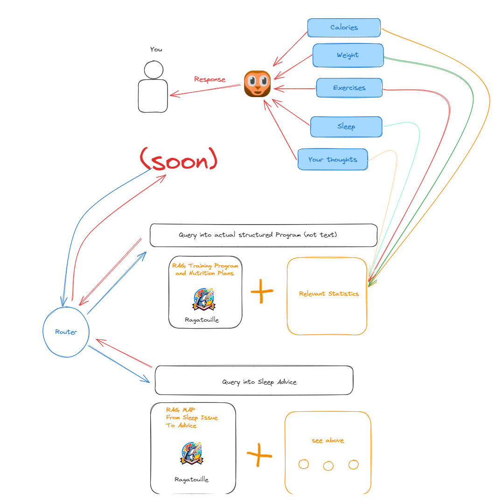

# Phaero

Phaero is an AI-based self-improvement companion that helps you keep a personal journal and extract statistical data from your entries. These entries will (not fully implemented yet) be fed back into Phaero to provide personalized advice based on your feelings and statistical analysis of your data.

## Installation

**IM NOT SURE IF GIT LFS WORKS, THE GITHUB REPO SHIPS WITH A FOOD DATABASE ~ 1GB (might be limited by bandwidth), BACKEND FAILS TO START WITHOUT IT ATM.**

- Install docker & docker compose
- Start using the docker compose file in the root folder.

Visit [localhost:5173](http://localhost:5173/signup) afterwards, keep in mind that some containers take a while (on my hardware it takes a few minutes and im pretty stacked) to fully start!
(You can also install it as PWA afterwards || if you go to localhost:4173/home you will be logged in automatically in the future)

- `GOOGLE_CLIENT_ID=""`
- `GOOGLE_CLIENT_SECRET=""`
- `OPENAI_KEY=""`
- `DEV_MODE=True`
- `USE_LOCAL_MODEL = True`
- `LOCAL_MODEL_URL = "http://host.docker.internal:11434/api/chat"`
- `ASSEMBLYAI_API_KEY=""`
- `GROQ_API_KEY=""`

**Make sure to run ollama pull llama3 and ollama serve, to use llama3 locally instead of groq & openai**
Currently GROQ is being used to write the journal entry, while OpenAI is used for any other AI task like processing the note, chat messages.
Google if you want to use Google Signup, Assembly AI for transcription in the Journal Entry, regular transcription works per Web Speech API

## Features

- Record journal entries via audio or text
- Automatic extraction of important information (sleep, bodyweight, exercises, calories)
- Personalized feedback based on your data (soon)
- Modified USDA Food Database + German Foods i've added

## Known Limitations

- If selfhosting, you would have to keep the container open 24/7 as the daily reset occurs as an interval job in the FASTAPI application, -> otherwise the next day you login it won't be reset and still show yesterday's note.
- There's still hallucination, mostly because it currently lazily formats the Note to avoid some costs (therefore just the chat messages will be used as a note, not an actual journal entry). This works fine until in the chat you ask a question like "What workouts should I do..." without explicity mentioning any this will hallucinate a training program in the processing.
Ideas to stop hallucination in NotFoundFoods and Exercises Found -> check with similarity search whether the Food or the Exercise actually exists in the text before the AI processed it.
- Code Quality is pretty bad, theres tons of redundancy in the crud.py file, some dead code in general, inconsistent typing, ...
- There's definitely some clean up to be done in the requirements.txt / node_modules (unused modules)

## Roadmap

- (DONE, without custom prompt tuning yet) Implement Ollama LLaMA 3 instead of OpenAI: Tested with LLaMA 3 8b, parsing statistical data works without any fine-tuning as a drop-in replacement.
- Finetune prompts for llama 3 (especially food extraction)

## Contact

- bry5981 on discord (i can help you set it up locally!)

## How It Works

- Text Message to Statistics

- Response based on your Data

- "Documentation"

